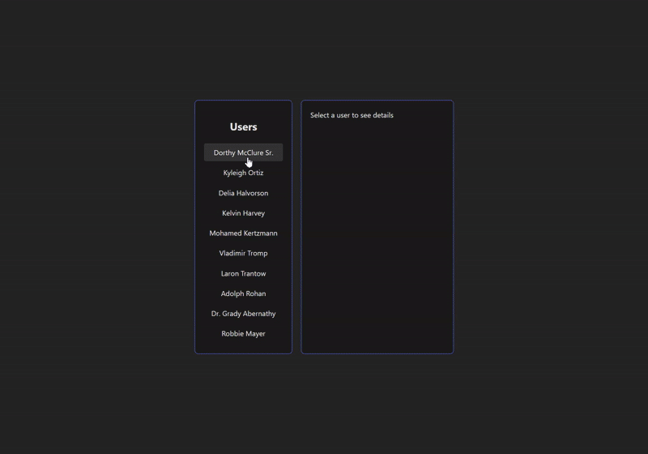

# useEffect

## Установка после клонирования репозитория

```
cd ra-homeworks-8-1
npm install
npm start
```

## Деплой


Ссылка на публичную страницу: https://ra-homeworks-8-1-git-main-maxim-terltskiis-projects.vercel.app


